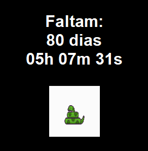

# ⏳ Contador de Dias para a Conclusão do Curso



## Sobre o Projeto

Este é um projeto simples, porém funcional, desenvolvido em Python para criar um widget de área de trabalho que funciona como um contador regressivo. Ele foi projetado para me ajudar a manter o foco no objetivo de concluir meu curso, mostrando os dias, horas, minutos e segundos restantes.

### Funcionalidades

- **Contagem em tempo real**: Atualiza a cada segundo, mostrando o tempo exato para a data final.
- **Interface minimalista**: Um design simples, sem bordas ou barra de título, que se integra à área de trabalho.
- **Personalizável**: Cores e fontes podem ser facilmente ajustadas no código.
- **Ícone do Python**: Inclui o logo do Python como parte do design, usando a biblioteca Pillow.

## Tecnologias Utilizadas

- **Python**: A linguagem de programação principal.
- **Tkinter**: A biblioteca padrão do Python para criação da interface gráfica.
- **Pillow**: Usada para processar e exibir a imagem do logo.

## Instalação e Execução

Para rodar este projeto em seu ambiente local, siga os passos abaixo:

1.  Clone o repositório ou baixe o código-fonte.
2.  Navegue até a pasta do projeto em seu terminal.
3.  **Recomendado**: Crie e ative um ambiente virtual.
    ```bash
    python -m venv venv
    .\venv\Scripts\activate
    ```
4.  Instale a biblioteca `Pillow`.
    ```bash
    pip install Pillow
    ```
5.  Execute o script principal.
    ```bash
    python main.py
    ```

## Contato

Desenvolvido por **Guilherme Augusto Gouvea**.

[](https://github.com/guilhermegouve4)
[](https://linkedin.com/in/guilhermegouve4)

---
*Este `README` foi gerado para auxiliar no aprendizado de Python e de boas práticas de desenvolvimento.*